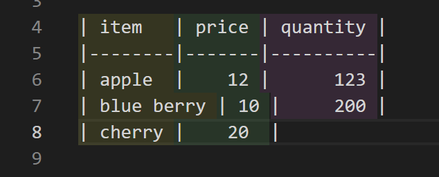

# markdown-table-rainbow

A extension that colorizes table columns in Markdown for clarity.

## Features

This extension colors by columns in markdown tables.



## Extension Settings

You can use it without any setting.
However, you can also change:

```js
  // Delay time in milliseconds before updating colors.
  // Smaller values will color faster, but will increase processing cost.
  "markdownTableRainbow.updateDelay": 500,
  // An array of color strings (hex, rgba, rgb) for each column.
  // You can specify any number of colors. used cyclically.
  "markdownTableRainbow.colors": [
    "rgba(255,255,63,0.1)",
    "rgba(127,255,127,0.1)",
    "rgba(255,127,255,0.1)",
    "rgba(79,236,236,0.1)"
  ]
```
